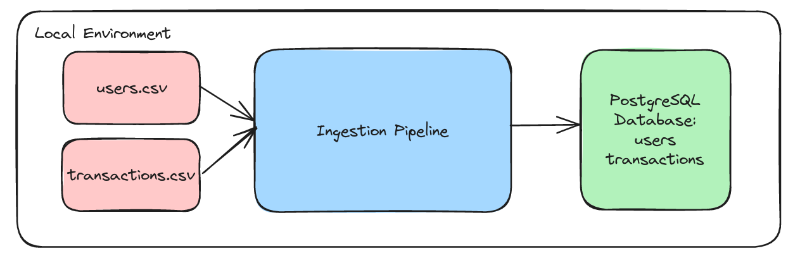

# Ingestion Pipeline

Objective: Design and implement an ETL process that collects data from a set of source files, transforms it according to specific requirements, and loads it into a target datastore.

## Solution Overview

## Prerequisites
- docker compose


## Setup
To run the ingestion pipeline, we need to run a local PostgreSQL database and setup the virtual environment
### PostgreSQL
1. Run `docker-compose up -d` to provision a local database named `first_circle_db`.
    ```
    justinberedo@pop-os:~/github/ingestion-pipeline$ docker-compose up -d
    Creating network "ingestion-pipeline_default" with the default driver
    Creating ingestion-pipeline_postgres_1 ... done
    ```
2. To create the tables, run `make tables`. The database password is `db_password`.
3. To verify, run `make connect_db` and type in the password. You should now have access to the database. To view the created tables run `\dt`:
    ```
    first_circle_db=# \dt
                List of relations
    Schema |     Name     | Type  |  Owner  
    --------+--------------+-------+---------
    public | transactions | table | db_user
    public | users        | table | db_user
    (2 rows)
    ```
### Virtual Environment
1. Run `make dev` to create the virtual environment, activate it, and install the dependencies.

## Running the pipeline
1. Make sure the virtual environment is activated: `source .venv/bin/activate` 
2. To run the pipeline, in the terminal run `python etl.py`
    ```
    (.venv) justinberedo@pop-os:~/github/ingestion-pipeline$ python etl.py
    2023-11-05 09:13:43 - INFO - Number of records from data_sources/users.csv: 5
    2023-11-05 09:13:43 - INFO - Number of records from data_sources/transactions.csv: 9
    2023-11-05 09:13:43 - INFO - Latest user_id in users table: None
    2023-11-05 09:13:43 - INFO - Latest user_id in transactions table: None
    2023-11-05 09:13:43 - INFO - Number of records loaded to users table: 5
    2023-11-05 09:13:43 - INFO - Number of records loaded to transactions table: 9
    2023-11-05 09:13:43 - INFO - Number of records updated in users table: 5
    ```
3. To verify, you can check the table values by running `make connect_db` then running:
    ```SQL
    select * from users;
    select * from transactions;
    ```
### New records
1. Let's say there are new records in `users.csv`
    ```
    6,Justin Beredo, justin@email.com,2023-11-05
    ```
    Running the pipeline will output:
    ```
    (.venv) justinberedo@pop-os:~/github/ingestion-pipeline$ python etl.py
    2023-11-05 09:16:54 - INFO - Number of records from data_sources/users.csv: 6
    2023-11-05 09:16:54 - INFO - Number of records from data_sources/transactions.csv: 9
    2023-11-05 09:16:54 - INFO - Latest user_id in users table: 5
    2023-11-05 09:16:54 - INFO - Latest user_id in transactions table: 1009
    2023-11-05 09:16:54 - INFO - Number of records loaded to users table: 1
    2023-11-05 09:16:54 - INFO - No new transactions.
    ```
2. Let's say there are new records in `transactions.csv`. 
    ```
    1010,5,Kindle,89,2023-11-05
    1011,6,iPhone,999,2023-11-05
    ```
    Running the pipeline will output:

    ```
    (.venv) justinberedo@pop-os:~/github/ingestion-pipeline$ python etl.py
    2023-11-05 09:18:02 - INFO - Number of records from data_sources/users.csv: 6
    2023-11-05 09:18:02 - INFO - Number of records from data_sources/transactions.csv: 11
    2023-11-05 09:18:02 - INFO - Latest user_id in users table: 6
    2023-11-05 09:18:02 - INFO - Latest user_id in transactions table: 1009
    2023-11-05 09:18:02 - INFO - No new users.
    2023-11-05 09:18:02 - INFO - Number of records loaded to transactions table: 2
    2023-11-05 09:18:02 - INFO - Number of records updated in users table: 2
    ```
3. Lastly, say there are new records in `users.csv`
    ```
    7,Justin Hart, justinhard@email.com,2023-11-05
    ```
    and in `transactions.csv`
    ```
    1012,7,iPhone,999,2023-11-05
    ```
    Running the pipeline will output:
    ```
    (.venv) justinberedo@pop-os:~/github/ingestion-pipeline$ python etl.py
    2023-11-05 09:21:33 - INFO - Number of records from data_sources/users.csv: 7
    2023-11-05 09:21:33 - INFO - Number of records from data_sources/transactions.csv: 12
    2023-11-05 09:21:33 - INFO - Latest user_id in users table: 6
    2023-11-05 09:21:33 - INFO - Latest user_id in transactions table: 1011
    2023-11-05 09:21:33 - INFO - Number of records loaded to users table: 1
    2023-11-05 09:21:33 - INFO - Number of records loaded to transactions table: 1
    2023-11-05 09:21:33 - INFO - Number of records updated in users table: 1
    ```

## Tests
- To run the unit tests: `pytest tests`
